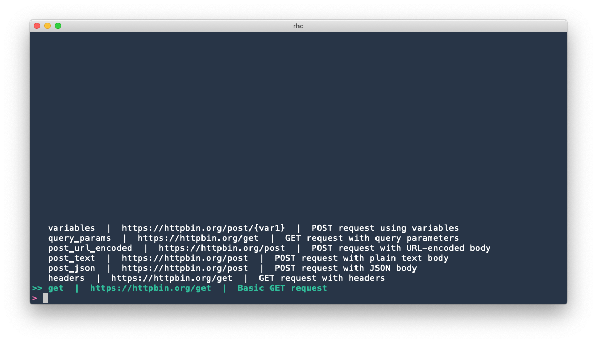
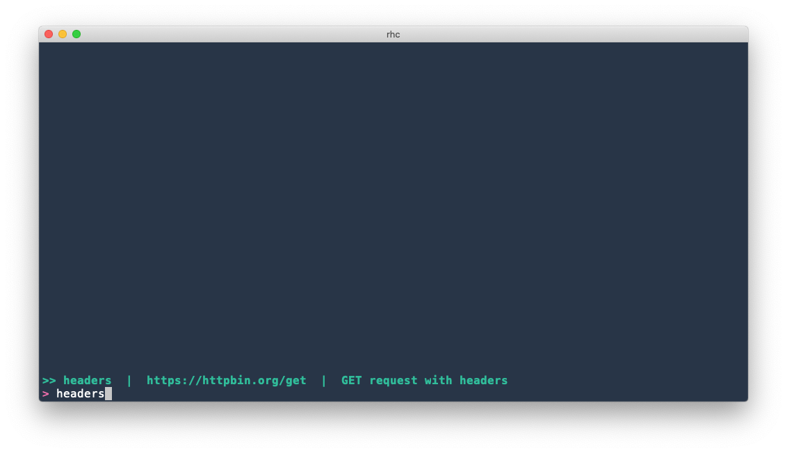

# rhc: Command-line HTTP client



## Introduction

`rhc` is a command-line tool for storing and quickly dispatching HTTP requests. It fits well into a command-line/terminal-centric workflow, and is designed to allow you to select and dispatch a desired request as quickly as possible.

## Installation

(TODO)

## Usage

### Request Definitions

#### Basics
Using rhc requires at least one "request definition" file. This type of file is in [TOML](https://github.com/toml-lang/toml) format and contains information about a single HTTP request you want to send (the URL, method, body, etc.). As an example, try placing the following content at `~/rhc/definitions/test.toml`:

```toml
[request]
url = "https://httpbin.org/get"
method = "GET"
```

Then try running `rhc ~/rhc/definitions/test.toml`. rhc will send a GET request to `https://httpbin.org/get`, and you should see the response, including the status code, headers, and body printed to stdout.

Running `rhc --help` will show a brief description of available command-line arguments, most of which are explained more fully in this document.

#### Request
The `request` table in the request definition file species the method and URL to use. Both are required. 

Valid values for the `method` key are "GET", "POST", "PUT", "DELETE", "HEAD", "OPTIONS", "PATCH", and "TRACE".

#### Query Parameters
You can specify query parameters in the `query` table:

```toml
[request]
url = "https://httpbin.org/get"
method = "GET"

[query]
params = [
  { name = "id", value = "12345" }
]
```

Alternatively, you can specify them directly in `request.url`:

```toml
[request]
url = "https://httpbin.org/get?id=12345"
method = "GET"
```

#### Headers
You can specify headers under a `headers` table:
```toml
[request]
url = "https://httpbin.org/get"
method = "GET"

[headers]
headers = [
  { name = "Accept-Language", value = "fr-CH, fr;q=0.9, en;q=0.8, de;q=0.7, *;q=0.5" },
  { name = "Authorization", value = "Bearer xyz" }
]
```

#### Body
You can specify a request body as plain text, a JSON value or URL-encoded data. You must specify which of these body types you want to use under the `body.type` key, and the body itself under the `body.content` key.

```toml
[request]
url = "https://httpbin.org/post"
method = "POST"

# Plain text body
[body]
type = "text"
content = "Some plain text"
```

```toml
[request]
url = "https://httpbin.org/post"
method = "POST"

# JSON body
[body]
type = "json"
content = '''
{
  "some_key": "some value",
  "a_number": 123,
  "nested": {
    "inside": true,
    "other": null
  }
}'''
```

```toml
[request]
url = "https://httpbin.org/post"
method = "POST"

# URL-encoded body
[body]
type = "urlencoded"
content = [
  { name = "key1", value = "something" },
  { name = "あいうえお", value = "猪" }
]
```

The `Content-Type` header on the request will automatically be set to `text/plain`, `application/json`, or `application/x-www-form-urlencoded`, respectively. Note that for a JSON body, it is recommended to use [multi-line literal strings](https://github.com/toml-lang/toml#string) (triple single-quotes) to wrap the raw JSON value. This way you can use double quotations to place JSON strings in the body.

Note that `multipart/form-data` requests are not directly supported.

#### Metadata
An optional `metadata` table can provide extra information about the request definition that isn't actually used when sending the request. Currently there is one possible metadata key, which is `description`. This optional description will be displayed in rhc's interactive mode (to be explained later in this document).

```toml
[metadata]
description = "GET example using httpbin"

[request]
url = "https://httpbin.org/get"
method = "GET"
```

#### Variables
It's possible to use variables in most parts of the request definition, for values that could change depending on the context in which you're sending the request. Variables are denoted by surrounding them with curly braces. The ways that variables can be bound will be explained later, but first, this example shows all the places that variables can be used:

```toml
[request]
url = "https://httpbin.org/post?something={var1}" # In the URL
method = "POST"

[query]
params = [
  { name = "{the_name}", value = "{the_value}" } # In query parameters
]

[headers]
headers = [
  { name = "Authorization", value = "Bearer {token}" } # In headers
]

# In request bodies
[body]
type = "json"
content = '''
{
  "some_key": "{something}",
  "{something_else}": 123
}'''
```

One way to bind variables is to use the `-b` or `--binding` command-line argument:

```
$ rhc -b token=xyz -b something=12345 definition.toml
```

The other ways to bind variables involve environments and rhc's interactive mode, which will be explained next.

### Environments

Environments are predefined groups of variables that are stored in a TOML file. They have this format:
```toml
name = "Staging"
variables = [
  { name = "token", value = "xyz" },
  { name = "something", value = "12345" }
]
```

You can specify an environment file to use with the `-e` or `--environment` argument:

```
$ rhc -e staging.toml definition.toml
```

By doing so, all the variables defined in the environment file will be automatically bound, and specifying them via the command line is not necessary (although you can still do so, and bindings specified via the command line will take higher precedence).

The names and values of variables defined in an environment file must be TOML strings. It's still possible to use variables as, for example, JSON numbers and booleans:

```toml
# In the request definition file:
[body]
type = "json"
content = '''
{
  "a_number": {var1},
  "a_bool": {var2}
}
'''

# In the environment file:
variables = [
  { name = "var1", value = "123" },
  { name = "var2", value = "true" }
]
```

### Interactive Mode

Rather than specifying a request definition, environment, and bindings via command-line arguments, you can also set all of these by using rhc's interactive mode.

#### Interactively selecting a request definition

Running `rhc` without specifying a request definition file will open an interactive interface where you can select a request definition from among all the TOML files contained in your base definition directly, which is `~/rhc/definitions` by default, but can be customized with a [config file](#configuration-file). You can organize files under this directory as you like; for example, using subdirectories to represent groupings of request definitions for the same API:

```
~/rhc/definitions
├── weather_api
│   ├── get_forecast.toml
│   └── get_historical_data.toml
├── twitter
│   ├── post_tweet.toml
│   ├── get_tweets.toml
...
```

In interactive mode, rhc will initially display a list of all request definition files it can find, along with their descriptions, if present:


You can type freely to filter the list, using fuzzy matching:



Press ENTER to select the currently highlighted request definition file. Pressing TAB or Shift-TAB will change the currently selected environment, cycling through all environment files located in the base environments directory, which is `~/rhc/environments` by default. The name of the currently selected environment is displayed in the prompt. There are also a few more convenient key mappings you can use:

- `Ctrl-c` will quit rhc without sending any request
- `Ctrl-w` will cut to the start of the current word, Readline-style
- `Ctrl-u` will clear the current query
- `Ctrl-p` or `Up` will move the selection up
- `Ctrl-n` or `Down` will move the selection down

#### Interactively binding variables

rhc requires that all variables present in the selected request definition file be bound before sending. These bindings are taken first from the selected environment file, and then from the `--bind` / `-b` command-line argument (overwriting bindings in the environment file, if there are any overlaps). After this, if any unbound variables remain, you will be prompted to enter their values interactively: (TODO: screenshot)

rhc saves a history of what values you have bound to variables in the past, and will display a list of values previously used for the current (variable name, environment) pair. As you type, the displayed list will be filtered based on fuzzy-matching against what you have typed. Pressing ENTER will bind the current variable to what you have entered in the prompt. On the other hand, if you want to re-use a historical value, you can press TAB to switch from "entry mode" to "historical selection" mode, signified by the `>>` cursor appearing in the list of historical values. In this mode, pressing ENTER will bind the selected historical value, ignoring whatever is currently typed at the prompt. (TODO: screenshot)

Otherwise, the same key mappings described above apply here as well.

### Configuration File

rhc will look for an optional configuration file, in this order:
1. The file specified with the `--config` argument, if present
2. `$XDG_CONFIG_HOME/rhc/config.toml`, if `XDG_CONFIG_HOME `is defined
3. `~/.config/rhc/config.toml, `if present

If none of the above files are present, a default configuration will be used. Here's a sample config file with explanations of the settings and their default values:

```TOML
# The directory to scan for request definition files when run in interactive
# mode. Defaults to ~/rhc/definitions
request_definition_directory = "~/rhc/definitions"

# The directory to scan for environment files when run in interactive
# mode. Defaults to ~/rhc/environments
environment_directory = "~/rhc/environments"

# The file to store variable binding history in. Defaults to ~/.rhc_history
history_file = "~/.rhc_history"

# The maximum number of lines to save in the history file. Defaults to 1000.
max_history_items = 1000

# A timeout in seconds for establishing a TCP connection. Defaults to 30 seconds.
connect_timeout_seconds = 30

# A timeout in seconds for reading data. Defaults to 30 seconds.
read_timeout_seconds = 30

# A timeout in seconds for the entire request (until the request body finishes
# tranferring). Defaults to no timeout.
timeout_seconds = 30

# A theme to use to color JSON output. See below for more details.
theme = "~/rhc/one-half-light.tmTheme"

# Another way to sepcify a theme
# theme = "base16-ocean.dark"

# Various color settings. See below for more details.
[colors]
default_fg = "blue"
default_bg = "indexed(182)"
prompt_fg = "rgb(100, 150, 200)"
```

#### Theme
(rhc uses the [syntect](https://github.com/trishume/syntect) library for highlighting JSON output. The `theme` key in your config file can be either a string that maps to one of the [default syntect themes](https://docs.rs/syntect/4.2.0/syntect/highlighting/struct.ThemeSet.html#method.load_defaults), or a file path that contains a [Sublime Text syntax definition](http://www.sublimetext.com/docs/3/syntax.html#include-syntax). If no theme is specified, the "base16-eighties.dark" theme included in syntect will be used.

#### Colors
Various parts of the interactive rhc UI can be customized. The values can either be one of the basic terminal colors (`red`, `cyan`, `lightblue`, `lightmagents`, etc.), one of the extended 256 terminal colors (specified by number, e.g. `indexed(50)`), or an RGB color (specified like `rgb(10, 20, 30)`).

The keys available to customize are:

- `default_fg`: Foreground color for interactive choices that aren't selected
- `default_bg`: Background color for interactive choices that aren't selected
- `selected_fg`: Foreground color for interactive choices that are selected
- `selected_bg`: Background color for interactive choices that are selected
- `prompt_fg`: Foreground color for the prompt
- `prompt_bg`: Background color for the prompt
- `variable_fg`: Foreground color for unbound variables
- `variable_bg`: Background color for unbound variables
